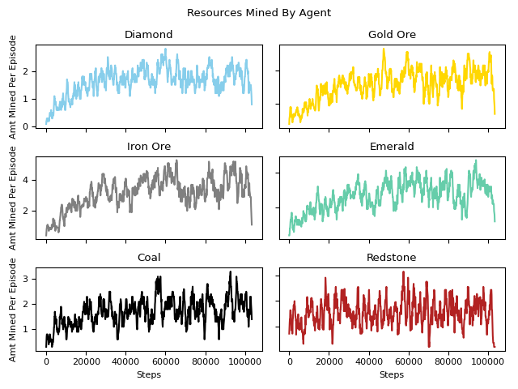

<p align="center">
  
</p>


Speed Miners will use Reinforcement Learning to gather as many resources in Malmo (Minecraft). The Minecraft character Steve will spawn with a diamond pickaxe to mine and gather as many coal, redstone, emerald, iron, gold, and diamond within the map.  We will create an environment filled with Lava, Stone, Coal Ores, Redstone Ores, Emerald Ores, Iron Ores, Gold Ores, and Diamonds Ores. Steve will need to explore the map and mine different types of blocks until he is trained to mine efficiently. 

Website: https://mickychetta.github.io/speed-miners/ 

<br>

# AI/ML Algorithm
We are taking a reinforcement learning approach using rllib for our resource gatherer. The specific algorithm we are using is the Proximal Policy Optimization (PPO), which is a model-free reinforcement learning method. PPO uses stochastic gradient descent and a clipped surrogate objective function as part of the loss function to prevent overly large updates to the policy. The clip function includes a hyperparameter, epsilon, that defines the maximum amount of change that can be applied to the policy. Below is the loss function used for PPO:

### PPO


<br>

We are utilizing Deep Q-Learning algorithm to compare the training behavior to the PPO agent:

### DQN


<br>

# Observations
Our observations are given to us within the `ObservationsFromGrid` tag in the `get_mission_xml()` function and the `get_observation()` function. Our observations are given to us in the form of a multi dimensional numpy array. Our observation grid represents the 2 x 5 x 5 area surrounding the agent. The observation space that we feed to the trainer is made to differentiate between the different types of ores. We use these numerical values to represent the different ores in the observation space:

```
self.blocks_dict = {
            "redstone_ore": 1,
            "coal_ore": 3,
            "emerald_ore": 4,
            "iron_ore": 5,
            "gold_ore": 6,
            "diamond_ore": 7,
            "lava": -1
        }
```

<i>Any other block is represented as a 0.</i>

<br>


<br>

# Rewards
Our agent will be rewarded for mining a variety of materials, including: diamond, gold, iron, emerald, coal, redstone. Higher valued ores will be more scarce within our grid.


| Materials | Rewards | Density |
| ----------- | ----------- | ----------- |
| Diamond | 6 | 2% |
| Gold | 5 | 7% |
| Iron | 4 | 10% |
| Emerald | 3 | 13% |
| Coal | 2 | 17% |
| Redstone | 0.1 | 25% |
| Lava | -5 | 10%

<br> 

# Results
After training our agent, there will be 6 graphs of different resources to show how well it mined each type of ore.



<br>

# Resources Used
* Rllib : https://docs.ray.io/en/latest/rllib.html
* OpenAI on PPO: https://spinningup.openai.com/en/latest/algorithms/ppo.html
* Numpy
* Matplotlib
* Stackoverflow
* Malmo XML documentation
* Markdown styling
* Campuswire
* Github
