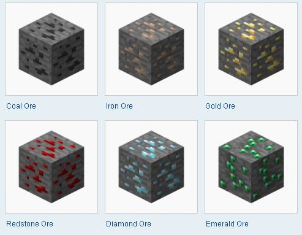

## Video

## Project Summary
Our goals for our project have largely remained the same since our status report. Our main goal is for our minecraft agent to gather resources as efficiently as possible within a certain time frame. These resources are a set of ores, which will be later defined in our approach section. Our agent is placed into a simulated cave environment with these resources available; also present are obstacles, such as lava and rails. The video above provides a clearer idea of what this environment looks like.

Solving this problem of mining as many resources within a time frame may seem simple and using AI/ML to tackle this problem may seem excessive. In our peer review feedback, Professor Singh mentions that "just gathering resources is not that impressive since the agent can just learn to break as many blocks as possible". To solve this issue, we decided to penalize the agent in certain ways, such as penalizing the agent when it touches bedrock. Bedrock, in our environment, is found under the layer of resources and stone, so if too many blocks are broken, than the agent would be penalized. We also weigh rewards for ores differently and set their distribution density accordingly, allowing for the agent to learn which ores to prioritize over others.

## Approaches


Observations, actions, rewards, and terminal states are important to identify for our agent, and below, we have briefly described them. 

### Observations
Our observations are given to us within the `ObservationsFromGrid` tag in the `get_mission_xml()` function and the `get_observation()` function. Our observations are given to us in the form of a multi dimensional numpy array. Our observation grid represents the 2 x 5 x 5 area surrounding the agent. The observation space that we feed to the trainer is made to differentiate between the different types of ores, as well as blocks we want to avoid like lava. We use these numerical values to represent the different blocks in the observation space:
```
self.blocks_dict = {
            "redstone_ore": 1,
            "coal_ore": 2,
            "emerald_ore": 3,
            "iron_ore": 4,
            "gold_ore": 5,
            "diamond_ore": 6,
            "lava": -1,
            "flowing_lava": -1
        }
```
Any other block is represented as a 0.

### Actions
Our agent's actions will consist of discrete movements, including turning left, turning right, moving forward, jumping and moving forward, and attacking. This will be represented by our action dictionary.

### Rewards
Our agent will be rewarded for mining a variety of materials, including: diamond, gold, iron, emerald, coal, redstone. Higher valued ores will be more scarce within our grid. It should be noted that mining some ores results in collecting more than 1 of the associated resource. For example, mining 1 redstone ore block results in 5 redstones collected. The rewards below indicate the reward for each individual resource collected.


| Materials | Rewards | Density |
| ----------- | ----------- | ----------- |
| Diamond | 6 | 2% |
| Gold | 5 | 7% |
| Iron | 4 | 10% |
| Emerald | 3 | 13% |
| Coal | 2 | 17% |
| Redstone | 0.1 | 25% |

<br>



### Terminal States
For our terminal states, we have deided to go with a timed approach rather than a step based approach. We set a threshold of 30 seconds for our agent to efficiently collect resources. Additionally, if the agent dies by touching lava, then the mission will end as well.

## Evaluation

## References
