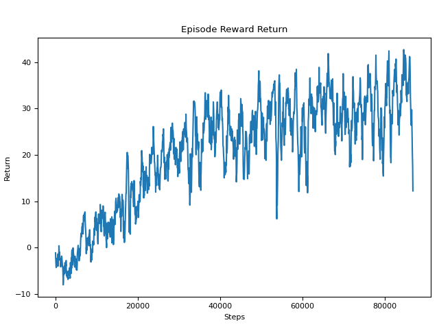
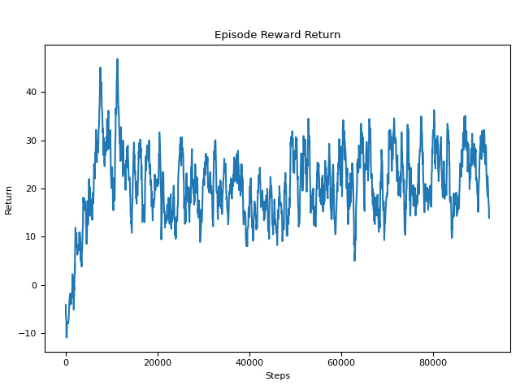
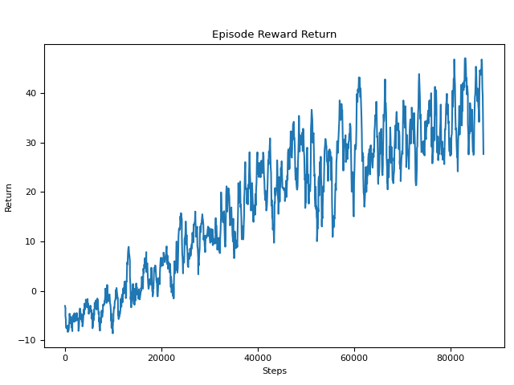
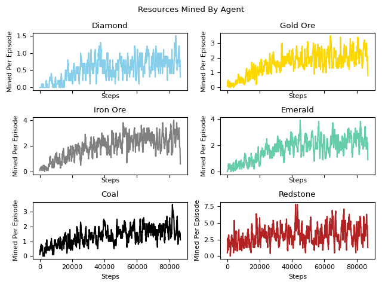
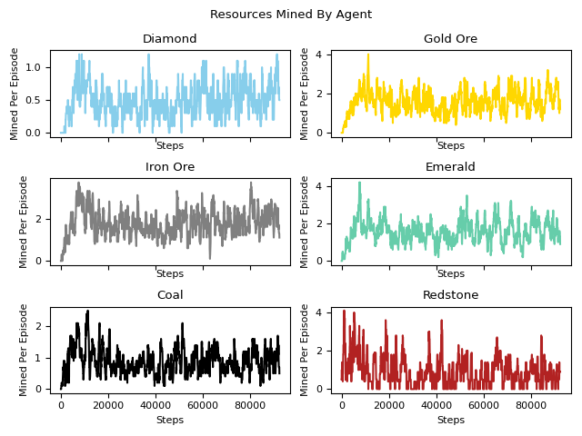
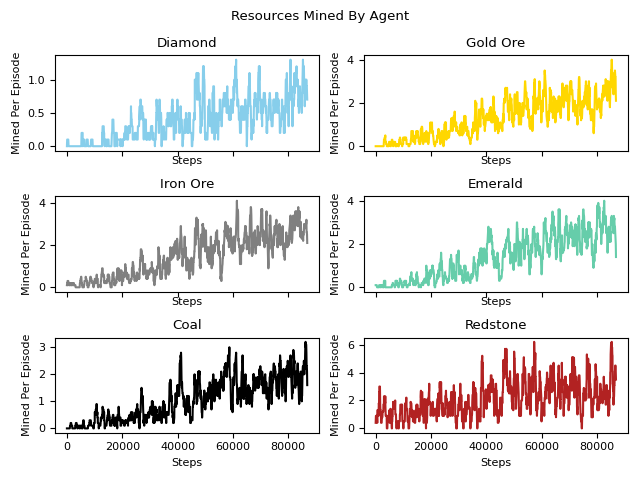
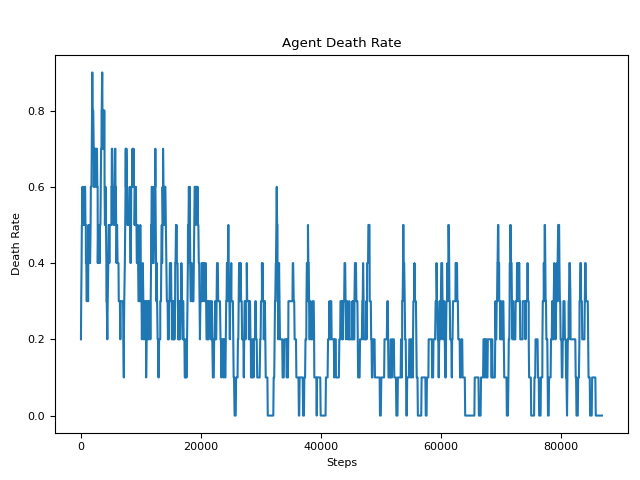
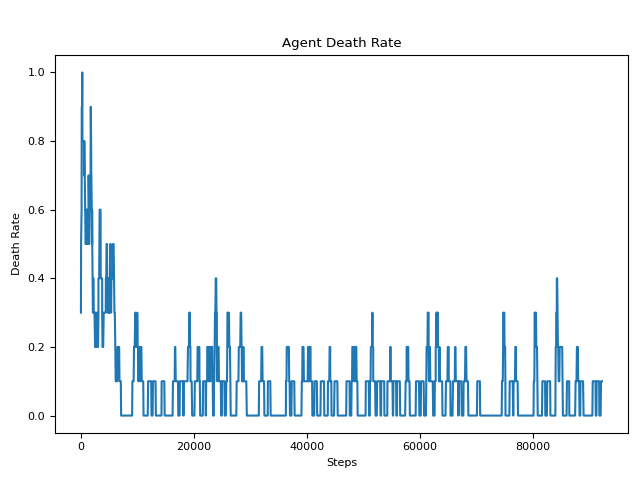
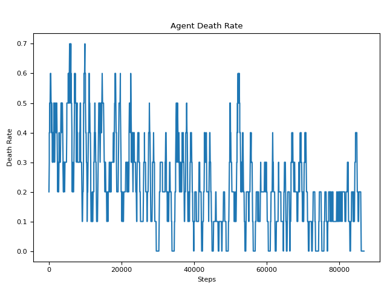

## Video

<iframe width="560" height="315" src="https://www.youtube.com/watch?v=DiP6g_6h6k0&feature=youtu.be" frameborder="0" allow="accelerometer; autoplay; encrypted-media; gyroscope; picture-in-picture" allowfullscreen></iframe>

## Project Summary
Our goals for our project have largely remained the same since our status report. Our main goal is for our Minecraft agent to gather resources as efficiently as possible within a certain time frame. These resources are a set of ores, which will be later defined in our approach section. Our agent is placed into a simulated cave environment with these resources and obstacles, such as lava and rails. The video above provides a clearer idea of what this environment looks like.

Solving this problem of mining as many resources within a time frame may seem simple and using AI/ML to tackle this problem may seem excessive. In our peer review feedback, Professor Singh mentions that "just gathering resources is not that impressive since the agent can just learn to break as many blocks as possible". To solve this issue, we decided to penalize the agent in certain ways, such as penalizing the agent when it touches bedrock. Bedrock, in our environment, is found under the layer of resources and stone, so if too many blocks are broken, than the agent would be penalized. This is implemented in order for our agent to avoid falling into holes. We also weigh rewards for ores differently and set their distribution density accordingly, allowing for the agent to learn which ores to prioritize over others.

<br>

## Approaches
In our baseline approach, we used a `6x6 `grid with only ores on the floor. The disadvantage of this approach is that our agent would always mine ores since our observation space always allowed the break action. When our agent fell into a hole, he was stuck there indefinitely because `jumpmove` had not been incorporated into our action space. This limited our agent from training effectively since we did not add any negative rewards to optimize the best mining. Also, there was only one graph of resources collected which didn't give any specific metrics to the different ores. 

The new approach we decided on was to penalize our agent for falling into lava, flowing lava, and bedrock. In this way, our agent will be trained to avoid these obstacles as they are mining valuable ores efficiently in our cave environment. The environment we used was a `20x20` grid with different types of ores and block types to simulate a real cave environment. With the additional `jumpmove` action, our agent is able to escape holes unlike our previous baseline approach. In addition, we added rails, gravel, and fixed the density of our rewards. The new rewards table is shown in the `Reward` section. Since adding lava, we added falling into lava as an additional terminal state. This will reset our agent and create accurate metrics and training data. We created 6 additional graphs, each representing the collection of a different ore versus total steps taken; these graphs are constructed in function `log_resources_collected()`. These additional graphs provide more insight into the performance of our agent. We continued to use the RLlib library with different reinforcement learning algorithms: PPO and DQN. We decided to compare the different algorithms to see which resulted in better performance.

### PPO


<br>

### DQN


### Observations
Our observations are given to us within the `ObservationsFromGrid` tag in the `get_mission_xml()` function and the `get_observation()` function. Our observations are given to us in the form of a multi dimensional numpy array. Our observation grid represents the 2 x 5 x 5 area surrounding the agent. The observation space that we feed to the trainer is made to differentiate between the different types of ores, as well as blocks we want to avoid like lava. We use these numerical values to represent the different blocks in the observation space:
```
self.blocks_dict = {
            "redstone_ore": 1,
            "coal_ore": 2,
            "emerald_ore": 3,
            "iron_ore": 4,
            "gold_ore": 5,
            "diamond_ore": 6,
            "lava": -1,
            "flowing_lava": -1
        }
```
Any other block is represented as a 0.

<br>


### Actions
Our agent's actions will consist of discrete movements, including turning left, turning right, moving forward, jumping and moving forward, and attacking. This will be represented by our action dictionary.

<br>


### Rewards
Our agent will be rewarded for mining a variety of materials, including: diamond, gold, iron, emerald, coal, redstone. Higher valued ores will be more scarce within our grid. It should be noted that mining some ores results in collecting more than 1 of the associated resource. For example, mining 1 redstone ore block results in 5 redstones collected. The rewards below indicate the reward for each individual resource collected.


| Materials | Rewards | Density |
| ----------- | ----------- | ----------- |
| Diamond | 6 | 2% |
| Gold | 5 | 7% |
| Iron | 4 | 10% |
| Emerald | 3 | 13% |
| Coal | 2 | 17% |
| Redstone | 0.1 | 25% |
| Lava | -5 | 10% |

<br>


### Terminal States
For our terminal states, we have decided to go with a timed approach rather than a step based approach. We set a threshold of 30 seconds for our agent to efficiently collect resources. Additionally, if the agent dies by touching lava, then the mission will end as well.

## Evaluation
### Evaluation Setup
The graphs and images discussed in the following sections will analyze the extent to which we solved the problem, while also comparing the results from using the PPO training algorithm against those of the DQN training algorithm.

### Quantitative Evaluation
In order to clearly see the improvements in our agent's performance, our program generates multiple types of graphs. Firstly, we will look at the returns graph, depicting the episodic reward rate in relation to the number of training steps taken. The top graph is the output from the PPO agent. There is an obvious increase in the accumulated reward per episode as training continues, up until around 40,000 steps where the improvement begins to plateau at an average of 30 reward points. In the bottom DQN graph, there isn't as consistent of a trend as PPO. The graph shows that the agent learned very quickly in the beginning, plateauing around 10,000 steps. However, the amount of reward that it stays at after that point is about 20 points, which is lower than the PPO when it stabilizes. The advantage of DQN is that the agent is able to learn quickly but a disadvantage is that it will not achieve our sufficient desired behavior. In our case, fast learning is not a priority but rather efficient and consistent learning which is why we decided to use the PPO agent. 

We also tested our PPO agent with a slight modification to its behaviors. We removed an `allow_break_action` boolean that allowed our agent to determine whether or not a resource is "breakable" (whether or not it is an ore). We remove this and add negative rewards for mining stone and gravel to see how differently our agent would learn and what trends may show from a run like this. In the bottom graph, our agent performs very similarly to our original PPO agent, but seems to maintain higher reward returns. It also still outperforms the DQN agent in the long run. 

#### PPO


#### DQN


#### PPO without allow_break_action


Additionally, our program outputs graph trends for each resource that has a positive reward. In our PPO resources graph, there is a general upward trend across each resource that begins to plateau around 40,000 steps, much like the reward graph trend. We can infer that the agent learns that it should be mining ores, versus just walking/jumping around. Notably, the redstone graph does not show any clear negative or positive trend. Since redstone is the least valued resource out of all of them, this graph result can mean that the agent learned to prioritize higher valued ores but without completely deprioritizing redstone since there is still value in mining them. In the DQN resources graph, the metrics shows that it is able to mine more resources in each type of ore. Similar to the rewards return evaluation, it is able to learn fast compared to the PPO agent but is not consistent in achieving the maximum amount of rewards. There is no clear pattern using the DQN agent which creates a random behavior in our training agent. Utilizing the PPO agent, we can see a stable increase in the rewards mine which gives a clear behavior that the agent is learning.

Again, we include our PPO agent without `allow_break_action`. Again, it seems to perform similarly to the original PPO agent, though it seems as if it performs very slightly worse across the board. It also seems to outperform the DQN agent in the long run; this is reflective of the conclusions drawn from the returns graphs above. 

#### PPO


#### DQN


#### PPO without allow_break_action


The last graph we will be looking at is the death rate graph. During an episode, the agent may die if it steps into lava or if it is in a hole that lava can flow into. The below graph results in an illustration of how frequently a death occurs as the agent trains. From the graph, we can see that the agent dies relatively frequently in the beginning of training. The death rate decreases as the agent learns and the general trend plateaus at around 0.2 after about 35,000 steps. This shows us that the agent was not able to completely avoid lava despite the negative reward associated with touching lava.

DQN seems to outperform both PPO agents in terms of death here. This is interesting to see as a death is attributed to lava, which would mean the DQN agent should have collected less negative rewards than both PPO agents. However, as we have seen from the first set of graphs, our DQN agent was outperformed by both PPO agents in terms of reward.

#### PPO


#### DQN


#### PPO without allow_break_action


### Qualitative Evaluation
For our qualitative evaluation, we will be analyzing our agent's performance based on observation on a number of tasks, the first of which is the agent's ability to prioritize mining higher valued ores.

In the beginning of training, the agent aimlessly wanders around and obviously does not know that it should be mining ores. In instances where there are ores right next to him—even high valued ores, the agent would walk away from them which makes it clear that the agent does not know to mine in those circumstances. After training, we are able to tell that the agent learned to prioritize ores such as diamond and gold. When the agent has multiple different ores in its observation space, it will head towards the higher valued ores first. Even though redstone is the most densely populated in the environment, the agent noticeably ignores many of them in favor of the other ores. The video more clearly demonstrates this idea.

In addition, since we also have rails in our environment, the agent would need to attack twice in order to mine an ore that is under a rail. We were also able to observe our agent executing consecutive attacks to reach the ore. 

The next task to observe is the agent's ability to avoid lava. THe agent at the beginning of training will often step into lava since the actions taken are more random. After training we can see that the agent has learned to avoid moving forward when there is a block of lava in front of him. Additionally, the agent seems to have learned to avoid lava that is going to flow towards him. In these instances, we can see that the agent is able to evade the lava by moving away from it and out of the hole. The video also more clearly illustrates the agent performing this action.


## References

* https://microsoft.github.io/malmo/0.14.0/Schemas/Types.html
* https://microsoft.github.io/malmo/0.14.0/Schemas/MissionHandlers.html
* https://docs.ray.io/en/master/rllib.html
* Rllib : https://docs.ray.io/en/latest/rllib.html
* OpenAI on PPO: https://spinningup.openai.com/en/latest/algorithms/ppo.html
* Numpy
* Matplotlib
* Stackoverflow
* Malmo XML documentation
* Markdown styling
* Campuswire
* Github
