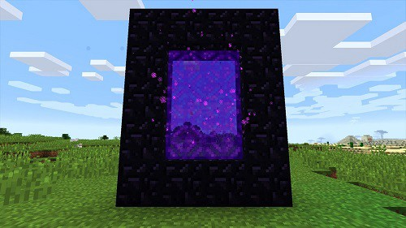
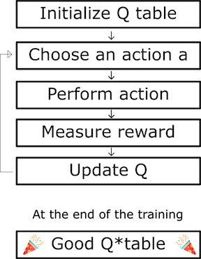

## Summary
 The Nether Portal Creator will use Reinforcement Learning to craft a Nether Portal in Malmo (Minecraft). The Minecraft character Steve will spawn with the necessary tools (Diamond Pickaxe & Flint and Steel) to mine Obsidian blocks and craft a Nether Portal.  We will create an environment filled with Lava, Water, Stone, Obsidian, Iron Ores, and Gravel. Steve will need to explore the cave and mine different types of blocks until he acquires 14 Obsidian blocks. After obtaining the necessary blocks, Steven will need to place the blocks accordingly and light it with Flint and Steel to form the Nether Portal. 

| Input      | Output |
| ----------- | ----------- |
| - Dictionary of rewards       | - Nether Portal       |
| - Mincraft Environment (XML)   |         
- Size/Grid of Nether Portal|

 

  

## AI/ML Algorithm
The Nether Portal Creator will use Reinforcement Learning and Q-Learning to determine how good an action is at a particular state. It will determine how good the blocks are to be mined and the placement of blocks.

 

 
 

## Evaluation Plan