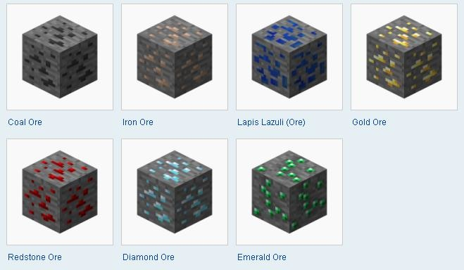

## Summary
Speed Miners will use Reinforcement Learning to gather as many resources in Malmo (Minecraft). The Minecraft character Steve will spawn with a diamond pickaxe to mine and gather as many coal, lapiz lazuli, redstone, emerald, iron, gold, and diamond within the map.  We will create an environment filled with Lava, Stone, Coal Ores, Lapiz Lazuli Ores, Redstone Ores, Emerald Ores, Iron Ores, Gold Ores, and Diamonds Ores. Steve will need to explore the map and mine different types of blocks until he is trained to mine efficiently. Some blocks are more valuable than others, so Steve will also need to learn to prioritize the higher-valued blocks.

| Input      
| ----------- |
| - Dictionary of rewards       |
| - Mincraft Environment (XML)   |         
| - Grid of Map|
 

## AI/ML Algorithm
Speed Miners will use reinforcement learning to determine how good an action is at a particular state. It will determine how good the blocks are to be mined and the placement of blocks.

## Evaluation Plan
The data we will be evaluating is the possible rewards for the agent’s action. Using our model-based approach enables us to train a dataset through mining and gathering tasks. In the beginning of the game, the agent will be positioned in the center of the grid generated by the provided XML. The cave will be a 100 by 100 playing field filled with various blocks such as lava, stone, coal ores, lapiz lazuli ores, redstone ores, emerald ores, iron ores, gold ores, and diamonds ores. As he continues to mine, the agent will start to get trained from the reward points of each resource. The baseline will be a 6 by 6 grid and we will have the agent mine as many resources as possible within a given time period.

There are a few core functions of our AI that are required to successfully mine fast and efficiently. As part of our qualitative analysis, we will be analyzing our AI’s ability to carry out each of these functions. Those core capabilities include mining the most amount of resources within a given grid and time frame. We will sanity check our AI by creating a smaller environment to see if our AI can learn to prioritize higher-valued blocks. 

## Plan of Action
By our status report, we hope to accomplish a few things. First, we would like to have our environment set up for our agent to be able to collect resources in. Similar to assignment 2, we know how to easily set diamond ore and lava; adding other materials should be relatively easy. Secondly (and ideally), having a simple working agent that can navigate the environment would be good to have. These two things combined would mean a working resource gatherer. To achieve these tasks, we have set up a weekly meeting time of Mondays at 8 PM to work on these tasks.
