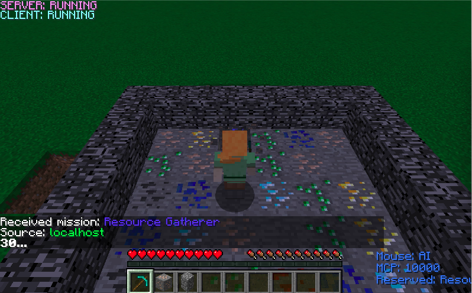
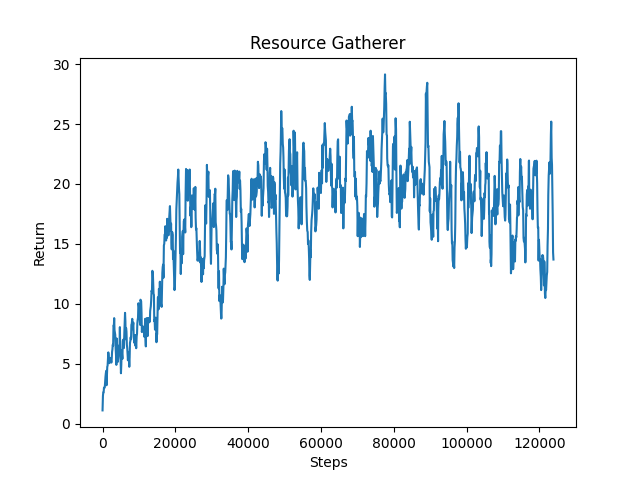

<iframe width="560" height="315" src="https://www.youtube.com/watch?v=Je34-26j4RI&feature=youtu.be&fbclid=IwAR2oSNIRgHvJHfKo3Z9kF-BsZtdDM93IuseaIsOQ-zkHK4dMvGIW7X8mViE" frameborder="0" allow="accelerometer; autoplay; encrypted-media; gyroscope; picture-in-picture" allowfullscreen></iframe>

# Project Summary
Our goals for our project have changed since our initial proposal. Our original proposal was to buid an agent that could gather the appropriate amount of obsidian, construct a nether portal, and activate it with flint and steel. After deciding that the original proposal would be too difficult, we've decided to focus on the gathering aspect. Our goal for our resource gatherer is to efficiently gather resources with varying values within a certain time limit. If time permits, we plan to have our agent craft weapons and armors as well. 

# Approach
We are taking a reinforcement learning approach using rllib for our resource gatherer. The specific algorithm we are using is the Proximal Policy Optimization (PPO), which is a model-free reinforcement learning method. PPO uses stochastic gradient descent and a clipped surrogate objective function as part of the loss function to prevent overly large updates to the policy. The clip function includes a hyperparameter, epsilon, that defines the maximum amount of change that can be applied to the policy. Below is the loss function used for PPO:

Observations, actions, rewards, and terminal states are important to identify for our agent, and below, we have briefly described them. 

### Observations
Our observations are given to us within the `ObservationsFromGrid` tag in the `get_mission_xml()` function and the `get_observation()` function. Our observations are given to us in the form of a multi dimensional numpy array. Our observation grid represents the 2 x 5 x 5 area surrounding the agent. The observation space that we feed to the trainer is made to differentiate between the different types of ores. We use these numerical values to represent the different ores in the observation space:
`self.blocks_dict = {
            "redstone_ore": 1,
            "lapis_ore": 2,
            "coal_ore": 3,
            "emerald_ore": 4,
            "iron_ore": 5,
            "gold_ore": 6,
            "diamond_ore": 7
        }`. 
Any other block is represented as a 0.

### Actions
Our agent's actions will consist of discrete movements, including turning left, turning right, moving forward, jumping, and attacking. This will be represented by our action dictionary.

### Rewards
Our agent will be rewarded for mining a variety of materials, including: diamond, gold, iron, emerald, coal, lapis lazuli, redstone. Higher valued ores will be more scarce within our grid.

| Materials | Rewards | Density |
| ----------- | ----------- | ----------- |
| Diamond | 6 | 3% |
| Gold | 5 | 6% |
| Iron | 4 | 10% |
| Emerald | 3 | 13% |
| Coal | 2 | 16% |
| Lapis Lazuli | 0.1 | 20% |
| Redstone | 0.1 | 20% |

 

## Terminal States
For our terminal states, we have deided to go with a timed approach rather than a step based approach. We set a threshold of 30 seconds for our agent to efficiently collect resources.

# Evaluation
In our evaluation process, we will take into consideration the rewards given from mining each ore. Each ore gives a reward based on its scarcity, which has been predetermined by our own choosing. Throughout our training period, we want our agent to mine higher valued rewards rather than the lower valued rewards within the 30 second time constraint for each episode.

For our baseline, we created a 6x6 grid for our agent to mine in. The ground includes different ores to mine, but does not yet include obstacles such as lava. Dispalyed below is what our baseline setup looks like:

 

After having our agent train overnight, our agent noticeably improved and was able to gather more rewards on average for each 30 second episode.
 

Our agent started off getting total reward scores below 10 for each episode, but overtime was able to achieve reward scores of 20 or above.

In the very beginning of training, the agent frequently got stuck in holes in the ground after mining something and remained there for the rest of the episode. After training, we noticed that the agent was much better about navigating around the holes that it made. We also noticed that the agent became better about prioritizing higher reward items such as diamond. 

# Remaining Goals and Challenges

### Goals
There are a few things that we'd like to change about our agent in order for it to potentially perform better. Firstly, we would like to add negative rewards for mining anything that is not an ore. This would help the agent learn to avoid mining into the wall around the grid, which would further help the agent learn to stay within the bounds of the grid and not wander away from where the rewards are.

We'd also like to modify our observation space to either prevent our agent from getting itself stuck in a hole, or to allow our agent to mine things around him when it does go into a hole. Presently, our observation space does not differentiate between what is air and stone, which is why our agent will still sometimes get itself stuck late into the training.

Additionally, we want to further the complexity by creating a larger grid for the agent to mine in and adding obstacles such as lava. We are also considering adding in jumps as an action to see if that would allow the agent to gather even more reward.

A stretch goal will be to transition from discrete movements to continuous movements to make this more realistic to actual Minecraft gameplay. Since blocks can be mined instantaneously with discrete movements but not with continuous, this would make our project much more complex as the agent would need to take into account the time that is taken to mine each type of block, and whether or not the reward is worth the amount of time spent.

### Challenges
Some of our goals will require us to expand our action dictionary and the observation space, which will likely require the agent to train even longer to reach a proficient level. One of our concerns is having an agent that will take too long to train given the things we want to give as input. What may potentially help us is experimenting with different reinforcement learning algorithms such as SAC, especially if we attempt to implement a continuous action space.

# Resources Used
Rllib, Numpy, Matplotlib, Stackoverflow, Malmo XML documentation, Markdown styling, Campuswire, Github,
OpenAI on PPO: https://spinningup.openai.com/en/latest/algorithms/ppo.html
